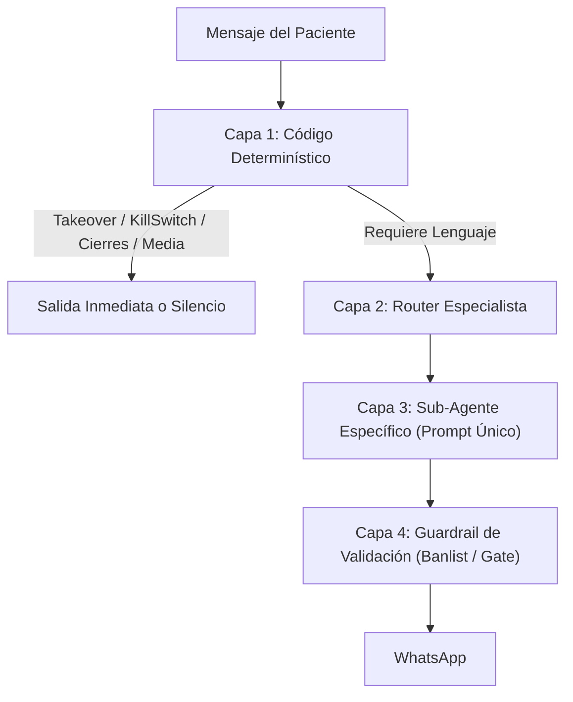

# 🏛️ Arquitectura y Matriz de Intenciones: Sistema Anti-Parches
> **Proyecto**: Agente WhatsApp Dra. Raquel Rodríguez (Áurea Odontología Estética)  
> **Filosofía**: En salud privada no existen los parches rápidos. Cada regla crítica responde a un incidente real, tiene una razón médica/operativa y se reparte entre **Arquitectura Limpia** (código) y **Prompt Especializado** (lenguaje).

---

## 1. La Tesis Central: ¿Dónde vive cada responsabilidad?

1. **El Código (n8n / Postgres / Redis)**: Decide qué turno gana, recuerda en qué paso estamos, ejecuta las herramientas y valida que Dentalink haya respondido antes de prometer una cita.
2. **El Prompt (LLM)**: Traduce, entiende la intención y redacta con empatía médica y tono cordial. **Nunca decide políticas de negocio ni inventa turnos.**
3. **La Base de Conocimiento (Supabase KB)**: Información pública para el paciente. **Cero cocina interna**, cero nombres de software (`Dentalink`), cero menciones a pantallas de la secretaria.

---

## 2. Matriz Exhaustiva de las 7 Intenciones (El Porqué y la Prevención)

---

### 🟢 INTENCIÓN 1: `onboarding` (Saludo Inicial y Menú Guiado)
- **Mensaje Típico**: *"Hola"*, *"Buenas tardes"*, *"Quería consultar"*.
- **El Peligro Real**:
  - Saludar seco (*"Hola, ¿en qué te ayudo?"*) obliga al paciente a tipear párrafos largos y desestructura la conversación.
  - O peor: escalar a la secretaria humana por un simple saludo inicial.
- **La Arquitectura (Código)**:
  - Si el chat es nuevo o pasaron más de 7 días, se activa el flag `es_onboarding`.
- **El Prompt Especialista (`Sub-Agent General`)**:
  - Saludo formal de Asiri + Despliegue estricto del **menú de 5 opciones**:
    1. Información de tratamientos
    2. Agendar un turno
    3. Consultar o reprogramar turno
    4. Precios y formas de pago
    5. Ubicación y horarios de atención
- **El Porqué**: Canaliza al 90% de los pacientes a una opción concreta de entrada. Evita ambigüedades.

---

### 🟢 INTENCIÓN 2: `ubicacion_y_horarios` (Ubicación y Disponibilidad)
- **Mensaje Típico**: *"¿Dónde queda el consultorio?"*, *"¿Qué días atiende la doctora?"*, opción "5".
- **El Peligro Real (Incidente Histórico 04/10)**:
  - Falsos positivos en Banlist: el bot ofrecía dar la ubicación pero la regla regex bloqueaba *"Balcarce 37"* creyendo que era una invitación espontánea, escalando al grupo sin sentido.
- **La Arquitectura (Código)**:
  - Exception tag: Dar la dirección física es **100% válido** cuando el paciente la pide explícitamente.
- **El Prompt Especialista (`Sub-Agent General`)**:
  - Dirección: `Balcarce Nº 37, 2º piso, San Salvador de Jujuy`.
  - Horarios: Lunes y Miércoles 15 a 19 hs | Martes, Jueves y Viernes 8 a 12 hs.
- **El Porqué**: La clínica no tiene vidriera a la calle; es un 2do piso en microcentro. La precisión de la dirección evita que pacientes se pierdan.

---

### 🟢 INTENCIÓN 3: `precios_y_pagos` (Consulta, Cuota y Alias)
- **Mensaje Típico**: *"¿Cuánto sale la consulta?"*, *"¿A qué alias transfiero?"*, *"¿Cuánto se paga por mes?"*.
- **El Peligro Real**:
  - Alucinar precios viejos ($40.000) o inventar costos totales de tratamientos de ortodoncia ($800.000), violando la ley médica y la política comercial de la clínica.
  - Olvidar el alias cuando piden precio + alias en el mismo mensaje.
- **La Arquitectura (Código)**:
  - Los números se extraen de `knowledge_base` (id=21 y id=24) y se inyectan en el prompt. El LLM no calcula ni inventa.
- **El Prompt Especialista (`Sub-Agent General`)**:
  - Primera Consulta: **$50.000** (Diagnóstico, evaluación fotográfica y plan).
  - Cuota Mensual Ortodoncia: **$70.000**.
  - Alias: `dra.raquel.aurea` (Brubank, Laura Raquel Rodríguez).
  - Regla: *"El costo del tratamiento completo se define en la consulta presencial según la complejidad de la boca."*
- **El Porqué**: La ortodoncia varía según si son brackets metálicos, autoligados o alineadores. Fijar un precio cerrado antes de ver la boca genera problemas legales y reclamos de pacientes.

---

### 🟢 INTENCIÓN 4: `agendar_nuevo` (Reserva en Sillón Dentalink)
- **Mensaje Típico**: *"Quiero sacar un turno para ponerme brackets"*, *"¿Qué turnos tienen libres?"*.
- **El Peligro Real**:
  - Preguntar *"¿Le queda mejor a la mañana o a la tarde?"* (Genera ping-pong infinito de mensajes innecesarios y viola la orden de la Dra. Raquel).
  - Agendar sin verificar la respuesta de la API de Dentalink (decir "Listo, te agendé" cuando Dentalink tiró error 500).
- **La Arquitectura (Código)**:
  - El sub-workflow `buscar_horarios` hace la llamada real a Dentalink y devuelve los bloques de turnos ya armados.
  - Solo si Dentalink responde `200 OK`, el código avanza.
- **El Prompt Especialista (`Sub-Agent Agendar`)**:
  - Muestra el bloque **exacto** tal cual lo entrega la tool (Mañana y Tarde).
  - Pide confirmar: *"¿Desea que le reserve el [Día] a las [Hora] hs?"*.
  - Al confirmar: ejecuta `reservar_turno`.
- **El Porqué**: Optimiza la tasa de conversión. Mostrar opciones concretas hace que el paciente elija en 1 mensaje en vez de debatir durante 1 hora.

---

### 🟢 INTENCIÓN 5: `confirmar_cita` (Post-Recordatorio)
- **Mensaje Típico**: *"Sí, confirmo"*, *"Ahí estaré"*, *"Voy"*.
- **El Peligro Real**:
  - Que el Router confunda este "Sí" con la confirmación de una cita que se estaba agendando en paralelo, o que no encuentre qué cita confirmar y derive a humana.
- **La Arquitectura (Código)**:
  - Consulta la tabla `recordatorios_enviados`. Si hay una cita con recordatorio mandado en las últimas 72hs, esa es la cita activa.
- **El Prompt Especialista (`Sub-Agent Confirmar`)**:
  - Llama a `confirmar_turno` (PUT a Dentalink).
  - Actualiza `recordatorios_enviados.confirmado_at = now()`.
  - Mensaje de confirmación firme + indicaciones de llegada.
- **El Porqué**: Automatiza el 100% de la confirmación de agenda. La secretaria no tiene que mandar mensajes manuales de WhatsApp para reconfirmar la agenda del día siguiente.

---

### 🟢 INTENCIÓN 6: `cancelar_o_reprogramar` (Gestión de Agenda)
- **Mensaje Típico**: *"No puedo ir mañana, me cancelás?"*, *"¿Podemos pasar el turno al viernes?"*.
- **El Peligro Real**:
  - Cancelar una cita por error ante una respuesta ambigua.
  - O dejar el visto clavado (`[NO_REPLY]`) cuando el paciente pidió reprogramar (Incidente Julieta).
- **La Arquitectura (Código)**:
  - **Cero LLM libre**: Esta intención pasa por el Sub-Workflow determinístico `5cAWJxiWJ50hxEq3`.
  - Exige doble confirmación obligatoria: lee la fecha y hora antes de borrarla de Dentalink.
- **El Porqué**: Una anulación médica borrada por error le quita el turno a un paciente que quizás esperaba hace 3 semanas y deja el sillón vacío.

---

### 🟢 INTENCIÓN 7: `urgencia_y_triaje` (Protocolo Mariela Safe)
- **Mensaje Típico**: *"Se me despegó un bracket y me pincha el alambre"*, *"Me duele mucho la muela, ¿puedo ir ya?"*.
- **El Peligro Real (Incidente Clave 09/05 - Mariela)**:
  - El bot le dijo a una madre un sábado: *"Guardá la pieza, venite ahora mismo a Balcarce 37, te esperamos"*. La madre salió hacia la clínica cerrada.
- **La Arquitectura (Código)**:
  - Motor determinístico de Triaje: evalúa palabras clave de dolor/urgencia.
  - Inyección obligatoria de la política de seguridad: **Consultorio privado con turno previo. Sin guardia 24hs.**
- **El Prompt Especialista (`Sub-Agent Urgencia` / Triaje)**:
  - **Cero diagnósticos médicos** (*"No te preocupes"*, *"Tomá ibuprofeno"* están TERMINANTEMENTE PROHIBIDOS).
  - Envía video oficial de primeros auxilios (cera ortodóncica en el alambre).
  - Notifica al grupo de WhatsApp del consultorio y avisa que se coordinará turno de ajuste en el próximo horario hábil.
- **El Porqué**: Protección de matrícula profesional de la doctora y seguridad del paciente. El bot nunca reemplaza a un odontólogo.

---

## 3. Resumen de Seguridad: Reglas de Oro Inviolables

| Componente | Lo que NUNCA debe hacer | Lo que SIEMPRE debe hacer |
| :--- | :--- | :--- |
| **Knowledge Base** | Mencionar nombres de software (`Dentalink`), colores de agenda (`punto amarillo`) o comandos (`/bot off`). | Contener únicamente información oficial de cara al paciente (precios, horarios, tratamientos). |
| **Router** | Deducir el estado de la conversación de los últimos 20 mensajes de chat. | Evaluar intención con prioridad estricta: `Urgencia > Cancelar > Confirmar > Agendar > General`. |
| **Agente Agendar** | Preguntar mañana o tarde; inventar confirmaciones si la tool falló. | Mostrar bloque directo de horarios; confirmar solo con ID de Dentalink. |
| **Banlist Validator** | Correr antes de los formateadores de texto. | Ser la **última compuerta** determinística antes de enviar el mensaje a WhatsApp. |
| **Takeover** | Silenciar chats para siempre sin retorno. | Reactivar el bot automáticamente a las 24 horas exactas de inactividad humana. |
