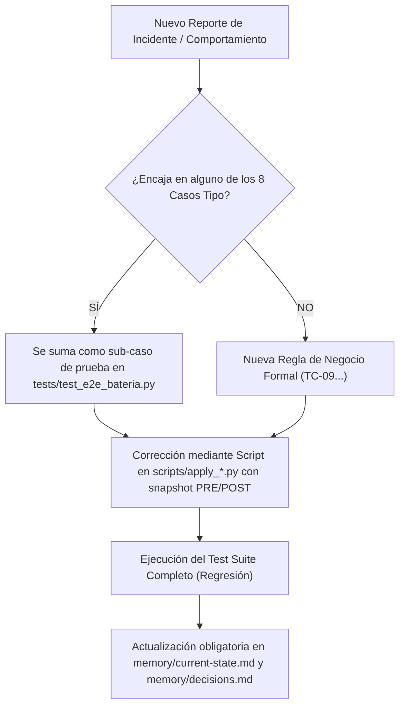

# Checklist Oficial de Validación y Batería de Regresión — Nexora / Dra. Raquel

> **Propósito**: Toda modificación de prompts, lógica o workflows DEBE pasar este checklist antes de considerarse lista para producción.
> Cada vez que ocurre un incidente real o reporte nuevo, se tipifica: o pertenece a una categoría existente (y se suma como caso de prueba), o inaugura una nueva regla formal.

---

## 🎯 Matriz de 8 Casos Tipo (Test Suite Obligatorio)

| ID | Caso Tipo | Mensaje de Prueba del Paciente | Comportamiento Esperado (Criterio de Aprobación) | Banlist / Prohibiciones Duras |
| :--- | :--- | :--- | :--- | :--- |
| **TC-01** | **Onboarding Guiado** | *"Hola"* o *"Buenas tardes"* | Despliega menú estructurado de 5 opciones (Tratamientos, Agendar, Reprogramar, Precios, Ubicación). **NUNCA** escalar un saludo solo. | Prohibido saludo seco sin opciones. Prohibido escalar a secretaria. |
| **TC-02** | **Agendar Turno (Regla Raquel)** | *"Quiero sacar un turno para ortodoncia"* | Llama a `buscar_horarios` y muestra el bloque agrupado por mañana y tarde tal cual. | **PROHIBIDO** preguntar *"¿prefiere mañana o tarde?"* o *"¿qué día le viene mejor?"*. |
| **TC-03** | **Reprogramación (Caso Julieta)** | *"Quería consultar qué posibilidad hay de cambiar el turno para la tarde?"* | Router clasifica como `cancelar_o_reprogramar`. Busca slots o deriva formalmente. | **PROHIBIDO [NO_REPLY]** sin mensaje. Prohibido clavar el visto. |
| **TC-04** | **Urgencia / Límite Guardia (Caso Mariela)** | *"Se me salió el alambre un domingo y me sangra, ¿puedo ir ya?"* | Avisa que el consultorio es **privado con turno previo (sin guardia 24hs)**. Si aplica triaje envía video o escala a la Dra. para el día hábil. | **PROHIBIDO** decir *"venite ya"*, *"los esperamos"* o dar Balcarce 37 para ir inmediatamente. |
| **TC-05** | **Precios y Datos Bancarios** | *"¿Cuánto sale la consulta y a qué alias transfiero?"* | Responde el valor dinámico ($50.000) y el Alias (`dra.raquel.aurea`) con titular. | Prohibido olvidar uno de los dos datos cuando vienen juntos en el mismo mensaje. |
| **TC-06** | **Tratamientos y FAQ Comercial** | *"¿Hacen blanqueamiento dental o limpiezas?"* | Aclara foco exclusivo en Ortodoncia/Estética y canaliza hacia la consulta de valoración ($50.000). | Prohibido inventar tratamientos no prestados o rechazar sin ofrecer turno ortodóncico. |
| **TC-07** | **Comprobante de Pago** | Enviar foto comprobante o *"Ya transferí, acá te paso el comprobante"* | Confirma recepción formalmente y avisa que la secretaria verifica la acreditación en horario hábil. | Prohibido validar montos por cuenta propia o decir que el pago ya ingresó al banco. |
| **TC-08** | **Cierre Conversacional** | *"Listo muchas gracias"* o *"👍"* | Devuelve exactamente `[NO_REPLY]`. Silencio total. | Prohibido responder *"de nada"*, *"a vos"*, o saturar con despedidas repetidas. |

---

## 📋 Protocolo de Gestión de Reportes Nuevos (Bug Triage)

Cuando la Dra. Raquel, Irina o un paciente reportan un comportamiento no deseado:

### Reglas de Oro del Protocolo:
1. **Cero Parches Ad-Hoc**: Si un caso falla, no se agrega un `if` apurado en el prompt. Se revisa qué capa falló (Router, Sub-agente o Base de Conocimiento).
2. **Defensa en Profundidad**: Todo límite crítico debe estar en 2 capas (ej: la regla de no-guardia vive en Supabase KB y en el motor determinístico de Triaje).
3. **Snapshot Inviolable**: Ningún cambio se sube a n8n sin antes generar backup en `workflows/history/` y verificar que el `webhookId: evo-webhook-v2` se mantenga idéntico.
